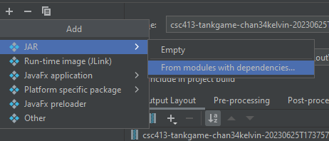
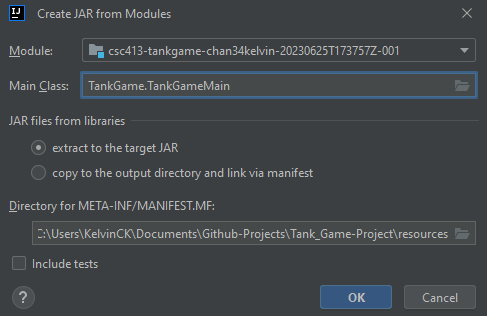
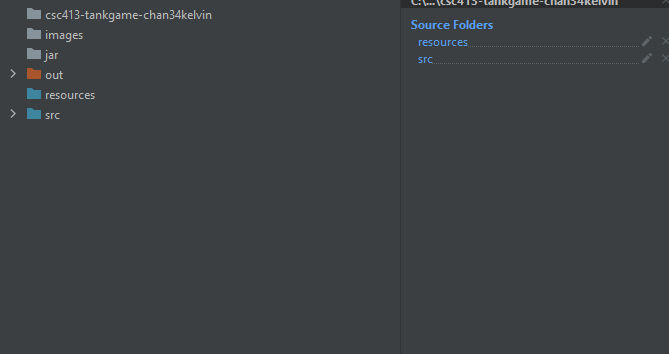
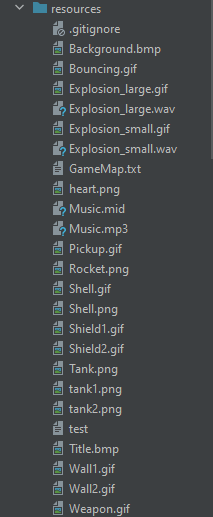
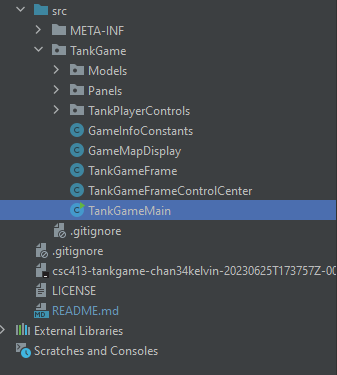
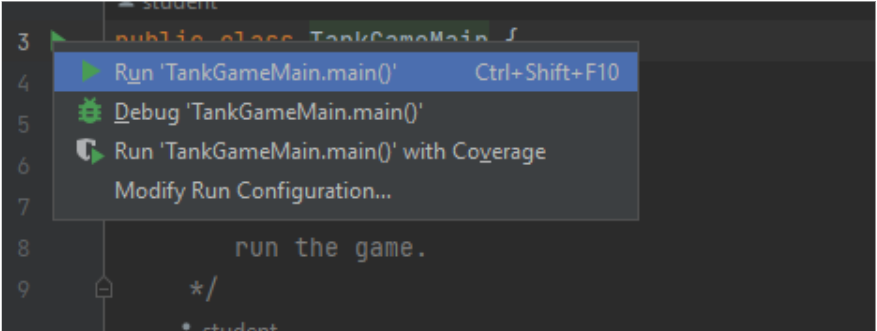
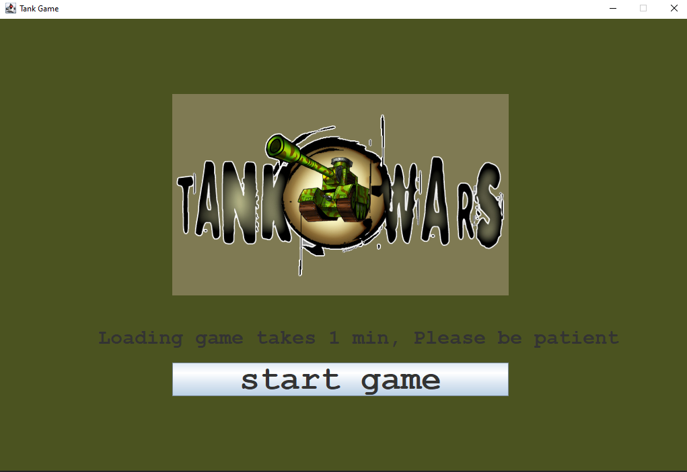
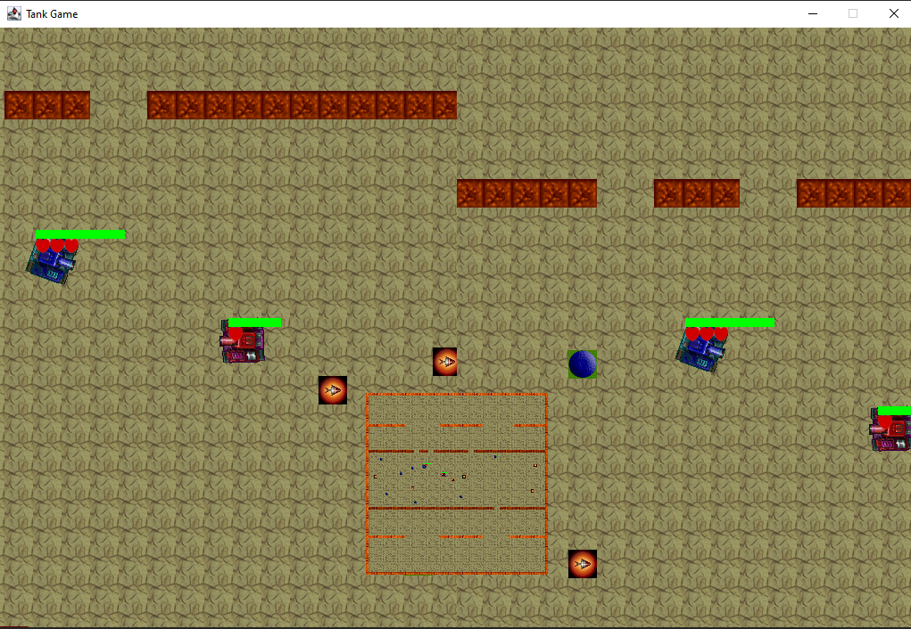
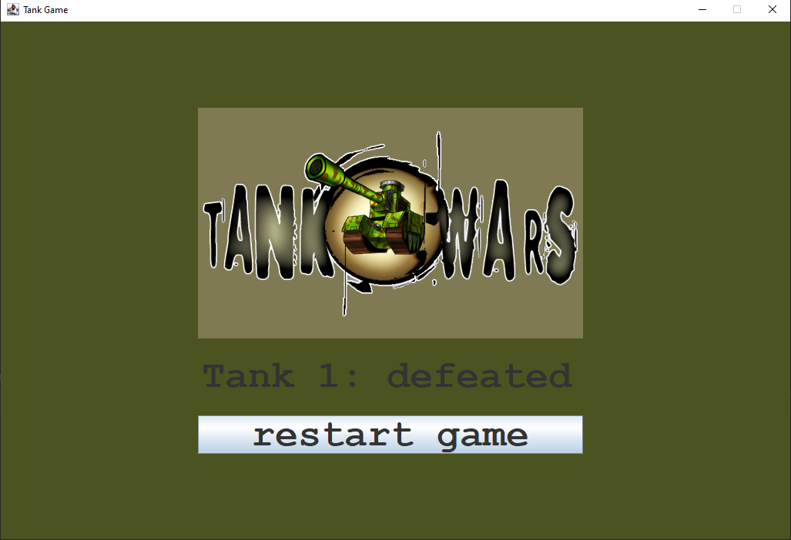

# CSC_413-Term_Project-Tank_Game

This is a 2D tank game using Java Swing GUI and the Model-View-Controller (MVC) pattern. It's a one-on-one battle where you control a tank on a split-screen. There's a handy minimap that shows the real-time map layout and actions.

The goal is simple: defeat your opponent by shooting bullets strategically. Along the way, you can collect power-ups like shields and rockets to gain an edge. To make things interesting, the game includes indestructible walls and breakable walls that divide the ability zone in the middle of the map.

This project demonstrates my skills in Java Swing GUI development, implementing the MVC pattern effectively, and creating interfaces that are easy to use and provide an enjoyable gaming experience.

- **Game Installation, Player Instructions are all below this.**

# Creator

- Kelvin Chan (Github: chan34kelvin)

# The MVC of Tank Game

Models - Tank-Game Objects are defined here, all the values, business logics, and the behaviours are encapsulated (Data hiding, abstraction (interfaces), consistency). Dividing them into Static and Moving objects.
- the x, y, hit-box range of the object.
- defining health value, damage value, and the shielding value.
- whether it's a static or a moving object.
- calculations of how much damage it takes when the bullet interacts with the tank, the damage reduction with the shielding. Validating whether the wall is breakable? the bullet hit the tank?

Views - Game Screens are defined here, the starting, ending, and gaming panels, the buttons, the controls.

Controller - This is where the key listeners are for the tank game. Where the initialization of the tank game happens. Listens to changes in the model and updates the view, like user interactions.

# Documentations

https://docs.google.com/document/d/11ERijenB2gNeqJ2-vQjpqGtCcQYjgSVv3QNRJqr59pw/edit?usp=sharing

# Installation

Open terminal and choose (Ex: cd Documents) where you want to store this game and git clone this repo.

## Pre-Requisites

This game requires Java to run, have the latest Java installed and the latest Intellij Community IDE Version.

Your Java version must be at least 20.0.1 (check with powershell and type java -version).
```
java version "20.0.1" 2023-04-18
Java(TM) SE Runtime Environment (build 20.0.1+9-29)
Java HotSpot(TM) 64-Bit Server VM (build 20.0.1+9-29, mixed mode, sharing)
```

If is not 20.0.1 or above install using this link. **(Choose x64 installer)**
https://www.oracle.com/java/technologies/downloads/#jdk20-windows

## To Play Game Directly

Go to jar folder and open the jar inside, it contains the game and is ready to play.

**Skip steps below if it works. Else the steps below can help you make it work. Game Controls below**

## Steps when IDE installed

- Open IDE, go to file on the upper left and open the repo you just cloned.
- Go back to file again and select project structure.
- In projects, make sure you have the latest sdk Ex: (openjdk-18 oracle openjdk verison 18) (this is the latest when I uploaded this project).
- Inside the same project structure window, choose artifacts and click + in the top left corner, select JAR and click from module. See images below.



- Choose the tank game main class and click apply in the bottom right corner.



- Go to module, click the srcs folder and in "mark as" section click sources, you will see the srcs folder added to the right side. 
- Do the same thing here by clicking resources folder and click sources in the "mark as" section again, you will see the resources folder added to the right side as well.



- After you see the same as the picture shown above, click apply.
- Check resources folder to see if all the images are inside as shown below.



- Go to TankGame/TankGameMain and find the green play button right next to the main class and click it. See images below.




- You have successfully run the tank game.

# Run Game and the Controls

To run the game, you must click the play button in the main class.

Once you start the game, wait about one minute for every static and moveable object to load. **The screen will be frozen for about 30 seconds, please be patient.**

Each game will provide two tanks. Both having 3 lives and a green rectangular healthBar indicating when a life will be taken away.

Tank Player 1 (Left)  Red

Controls:

	Forward key: w

	Backward key: s

	Rotate Left key: a

	Rotate Right key: d

	Shoot bullets key: space

Tank Player 2 (Right) Blue

Controls:

Forward key: pg_up (arrow top)

	Backward key: pg_down (arrow bottom)

	Rotate Left key: pg_left (arrow left)

	Rotate Right key: pg_right (arrow right)

	Shoot bullets key: enter

Each game will be given around 17 pickups for both tanks to compete picking up.

These pickups contain 9 shields in blue

These shields will provide a reduce damage of 0.013 (Limit 0.39) around 3 pickups
Another being 8 rockets in rocket shaped

These rockets will provide an upgrade of bullet to rocket for 5 shots (Limit 5 shots)

Picking up while using the 5 will not increase the number of rockets, instead the same effect.

Minimap is in the center to provide full vision of the map.

Rules: The player must defeat its opponent by using any usable pickups to assist. You must shoot the tanks until all lives are gone to win the game. No other rules, pure survival.

The loser or the person defeated will be displayed at the ending screen. Users can choose to restart.

# Project Snapshots






# Development Environment

- Version of Java : Java 14

- IDE used: IntelliJ IDEA Ultimate Edition 2020.1.1 x64

# Resources

The “heart.png” is obtained and downloaded from the below website and used as a tank live image.

https://banner2.cleanpng.com/20180318/plw/kisspng-love-heart-love-heart-romance-clip-art-picture-of-red-heart-5aaeb7181ca327.7123730415213995761173.jpg

“Tank1.png” and “Tank2.png” colored tanks were from Slack forum. Both were posted by Professor Anthony Souza. 
